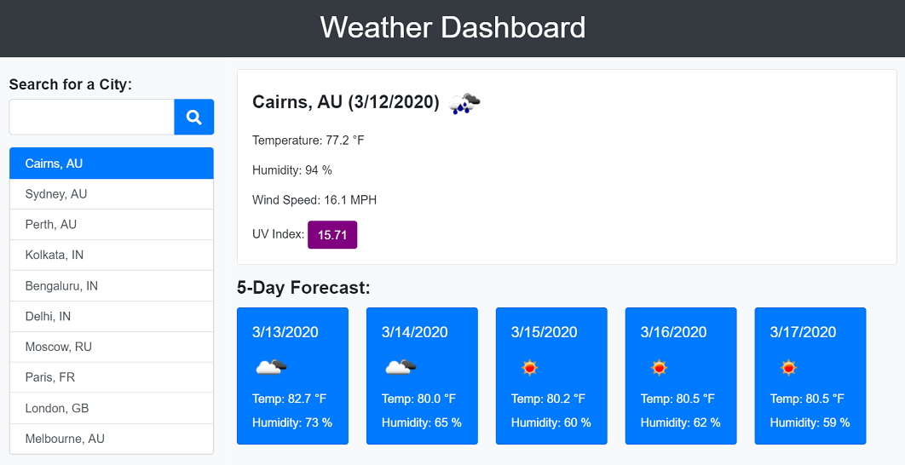
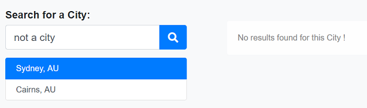

# Weather Dashboard

 

## Description
The weather dashboard enables users to view the weather outlook for any given city. Users have the option of searching for a city and the application then loads up the current and future weather conditions for that city. The application also maintains a history of the cities that were loaded up by the search. 

## Features
### Responsive Web Design 
This application is built using Responsive web design principles. Responsive web design provides better accessibility and an optimal viewing experience to the user, by ensuring that web pages render well on different devices and window / screen sizes. To achieve this, I have used the Bootstrap front-end component library to build my pages. 

### Open weather API
This application uses a third party API - the [OpenWeather API](https://openweathermap.org/api) to retrieve weather data for cities. 

## Functionality

When the weather dashboard is opened, it displays the city search form. Once the user enters a city and clicks the search button, the weather information for that city is displayed to the right. The city is then updated in the search history list below the search form. 

* If the search city is not entered when the user clicks the search button,a validation message is displayed to the user. 
* Once the weather information is loaded for a city, it is added to the search history. The search history is maintained for the last **10** successful searches. 
* If the user clicks on a city from the search history, the application loads up the weather details for that city.
* If the application is closed and re-opened, the weather details of the last searched city is loaded up by default.
* The 5-day weather forecast displays the weather conditions for the next 5 days for the given city based on midday values. If the 5-day forecast is not available for that city, the **"Unable to retrieve Forecast data!"** message is displayed.
* The UV Index is color coded as below:
    * **Low** (0-3): Green
    * **Moderate** (3-6): Yellow
    * **High** (6-8): Orange
    * **Very High** (9-11): Red
    * **Extreme** (11 and above): Purple
    * If the UV Index is not available / accessible: Grey 
* If the application is unable to fetch data for the city entered by the user, the below message is displayed:

The user can then edit the city and try again. 

## Known Issues / Limitations

This project currently uses the 5-day hourly Forecast API from open weather map and shows the weather information by estimating the midday values. This is not optimal and is a workaround since the 16-day daily forecast API is accessible only to paid accounts. 
